# freenasparseserver
Parse server on freenas for dummies - development install not for production

This is a documentation of how to configure a parse server on a Freenas jail.

Parse server is a nodejs module implemented in express.js framework, are there a lot of ways to install Parse server, like use a preinstalled VM, or use with a docker container. My freenas server doesn´t have the capability to run a VM, so I decided to run a plain installation.

What is needed ?

0. Freenas 11.3
1. MongoDB 3.6
2. Python 2.7
3. Node 12, npm
4. Git

## Step 1 - Create a new Jail

Create a jail with the following parameters: Static IP, with a virtual vnet, my static Ip is 192.168.0.54, you can choose any static Ip that has no collision with the others of your network.

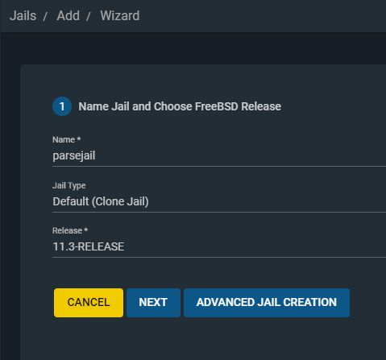

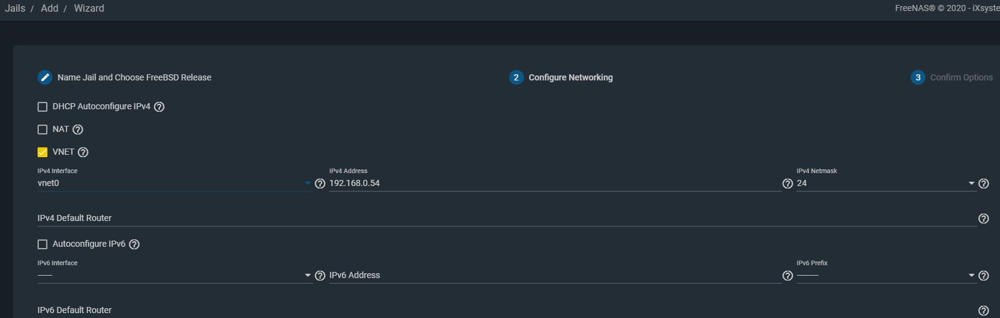

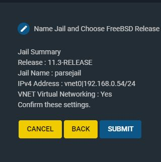

Once the jail is created, enter in the console. You can use the web console, but is to slow and doesn´t have a copy paste capability, so choose putty for a SSH connection, but first you have to configure access.

To configure access to the SSH, enter in the console and edit the file /etc/rc.conf, in this file enable writing sshd_enable=YES

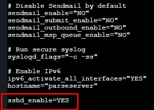

Then in the file /etc/ssh/sshd_config  find 
    PermitRootLogin no

and change for yes

    PermitRootLogin yes

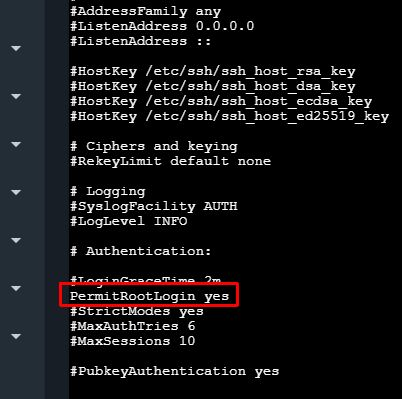

Then enable the creation of a new password for the jail writting in the console "passwd" to write the new password for the root access to the jail.

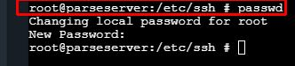

Then you can close the web console and test with the SSH client. For windows I choose putty.

## Step 2 - Install mongoDb

Write in the console:

    pkg search mongoDB

Find the 36 version and install:

    pkg install mongodb36-3.6.17

Once installed you can test installation running the service:

    service mongod onestart

To check if the service is running:

    service mongod onestatus

To stop the service:

    service mondod onestop

To enable running the service allways on the start, in the file /etc/rc.conf enable the service writing:

    mongod_enable=yes

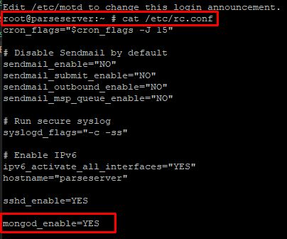

Restart the server and enter to the console to check if the server is running with the command

    service mongod onestatus

Also you can start mongo client writting:

    mongo

to exit from this console Ctrl-c

To enable MongoDb to be accessed from an external computer you can enable this feature looking for a file in /usr/local/etc/mongodb.conf

and change the default address to the 0.0.0.0

        # network interfaces
        net:
            port: 27017
            bindIp: 0.0.0.0   #default value is 127.0.0.1

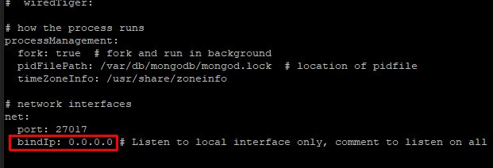

## Step 3 - Install node.js

Look for the node package

    pkg search node12

Install node v12

    pkg install node12-12.16.1_1

Do the same for npm.

    pkg search npm12

    pkg install npm-node12-6.12.1

Now install python27

    pkg install python27-2.7.17_1

The installation of parse needs to find the path of Python, so is necesary to create a Symlink

    rm /usr/local/bin/python   -> if there is a another symlink

    ln -s /usr/local/bin/python2.7 /usr/local/bin/python

To check if the Python can run in any path write in th console:

        python

To exit from the python console write:

        exit()

Choose a directory where the parse server express apllication will be installed. I choose /tmp/parse

        mkdir /tmp/parse

        cd /tmp/parse

Now we need to install git, to clone the repository  https://github.com/parse-community/parse-server-example  Example project using the parse-server module on Express.

    pkg search git

    pkg install git-2.26.2 

    git clone https://github.com/parse-community/parse-server-example

To Install de aplication over the clonned repository run npm install

    cd parse-server-examplke

    npm install

If all works well you can start parse server over express, check in the [index.js](index.js) file the initial parameters that you need like databaseUri, appId, masterKey, serverURL

    node index.js

To check if it´s working go to a web explorer and write: http://192.168.0.54:1337/parse . The Ip address is the Ip adrres of the jail.  then it shows the following message:

        {"error":"unauthorized"}

Stop the node process to stop the server.

Now we will install the parse dashboars over the same express node application. You can see more doccumentation to know https://github.com/parse-community/parse-dashboard#running-as-express-middleware

Install with npm parse dashboard, in the same directory of the project run:

    npm install parse-dashboard

In the [index.js](index.js) file modify it to use the middleware and put the data that fits your server, look the file in this repository with the parameters. 

Then you are ready to run again to check if the dashboard is running:

    node index.js

Enter to a web explorer and write:  http://192.168.0.54:1337/dashboard

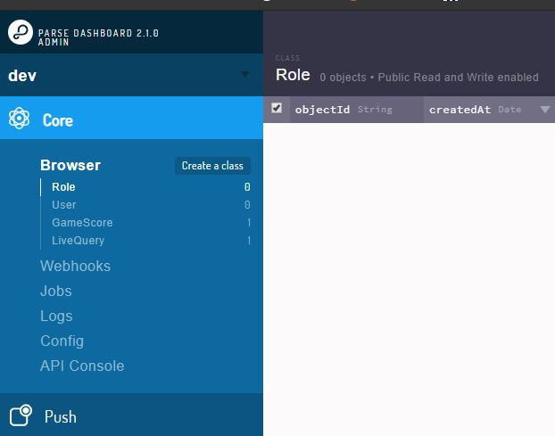

The final Step is to run the node project when the jail start. We will use a node utility named "forever". First install forever:

    npm install forever -g

over the path /usr/local/etc/rc.d directory create a file named "parse" with the information of this file [parse](parse)

change this lines in accordance with you project:

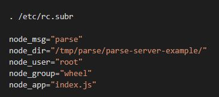

node_user and node_group has to be a user and group of your server that can run the node project.

Then check that the file can be executed with ls -l

    ls -t

and enable execution rights with

    chmod 777 parse

Check if the forever service is working. in the path /usr/local/etc/rc.d 

    service parse onestart

Then you need to enable service autostart. In the file /etc/rc.conf add the line node_enable="yes"

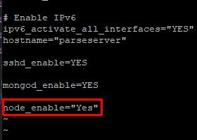

You are ready to check if the service stars after the server reboot.

# Problem with Cloud code functions #
When I have to run Cloud Code functions inside the standard setup, I found the following error:

        unauthorized

This error is shown int the Logs.

The solution that I found was at the end of the Link: https://github.com/parse-community/parse-server/issues/356

description:
In the index.js of parse installation you need to put javascriptKey : 'unused'.

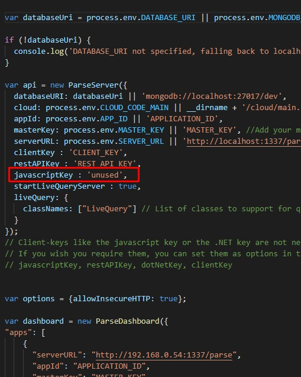

